# Movie Streaming Platform - Full Production Grade Architecture Diagram
## Go (REST + gRPC) + React + AI/ML

---

## 🏗️ Architecture Overview

This is a production-grade movie streaming platform using:
- **Frontend**: React SPA (single-page application)
- **External APIs**: REST/HTTP2 (JSON) for browser/mobile clients
- **Internal APIs**: gRPC for microservice communication
- **Event Bus**: Kafka for async processing & event streaming
- **Storage**: PostgreSQL, Redis, S3, Elasticsearch, Vector DB
- **AI/ML**: Recommendation engine, ASR, content moderation

---

## 📐 High-Level System Architecture

```mermaid
flowchart TB
    subgraph Client ["🌐 Client Layer"]
        WebApp[React Web App<br/>TypeScript + Redux]
        MobileApp[Mobile App<br/>React Native]
        AdminPanel[Admin Dashboard<br/>React + Material UI]
    end

    subgraph EdgeLayer ["⚡ Edge & CDN"]
        CDN[CloudFront/Cloudflare CDN<br/>HLS/DASH Segments]
        WAF[Web Application Firewall]
    end

    subgraph APIGateway ["🚪 API Gateway - Go REST"]
        Gateway[API Gateway<br/>HTTP/2 REST JSON<br/>Rate Limiting + Auth]
    end

    subgraph Microservices ["⚙️ Backend Microservices - Go gRPC"]
        AuthService[Auth Service<br/>gRPC<br/>JWT/OAuth2]
        UserService[User Service<br/>gRPC<br/>Profile/Preferences]
        ContentService[Content Service<br/>gRPC<br/>Movies/Series/Metadata]
        PlaybackService[Playback Service<br/>gRPC<br/>Streaming URLs]
        SearchService[Search Service<br/>gRPC<br/>Full-text + Filters]
        RecoService[Recommendation Service<br/>gRPC<br/>AI-powered Personalization]
        UploadService[Upload/Ingest Service<br/>gRPC<br/>Multipart Upload]
        AnalyticsService[Analytics Service<br/>gRPC<br/>Events/Telemetry]
    end

    subgraph Workers ["🔧 Background Workers - Go"]
        TranscodeWorker[Transcode Worker Pool<br/>FFmpeg<br/>HLS/DASH Output]
        ThumbnailWorker[Thumbnail Generator<br/>FFmpeg]
        ASRWorker[ASR Worker<br/>Whisper API<br/>Subtitles/Captions]
        ModerationWorker[Content Moderation<br/>Vision AI]
        EmbeddingWorker[Embedding Generator<br/>Content Vectors]
    end

    subgraph EventBus ["📨 Event Bus"]
        Kafka[Apache Kafka<br/>Event Streaming]
    end

    subgraph DataLayer ["💾 Data Layer"]
        Postgres[(PostgreSQL<br/>Relational Data<br/>Users/Content/Metadata)]
        Redis[(Redis Cluster<br/>Cache + Sessions<br/>Rate Limiting)]
        S3[(S3 Object Storage<br/>Video Files<br/>HLS Segments)]
        Elasticsearch[(Elasticsearch<br/>Search Index<br/>Full-text)]
        VectorDB[(Vector Database<br/>Qdrant/Pinecone<br/>Embeddings)]
    end

    subgraph AI ["🤖 AI/ML Services"]
        RecoEngine[Recommendation Engine<br/>Collaborative Filtering<br/>Content-based]
        ASR[Whisper ASR<br/>Speech-to-Text]
        VisionAPI[Vision AI<br/>Auto-tagging<br/>Moderation]
    end

    subgraph Observability ["📊 Observability"]
        Prometheus[Prometheus<br/>Metrics]
        Grafana[Grafana<br/>Dashboards]
        Jaeger[Jaeger<br/>Distributed Tracing]
        ELK[ELK Stack<br/>Centralized Logs]
    end

    %% Client to Edge
    WebApp -->|HTTPS| WAF
    MobileApp -->|HTTPS| WAF
    AdminPanel -->|HTTPS| WAF
    WebApp -->|HLS Stream| CDN
    MobileApp -->|HLS Stream| CDN

    %% Edge to Gateway
    WAF -->|HTTPS REST| Gateway

    %% Gateway to Microservices (gRPC)
    Gateway -.->|gRPC| AuthService
    Gateway -.->|gRPC| UserService
    Gateway -.->|gRPC| ContentService
    Gateway -.->|gRPC| PlaybackService
    Gateway -.->|gRPC| SearchService
    Gateway -.->|gRPC| RecoService
    Gateway -.->|gRPC| UploadService
    Gateway -.->|gRPC| AnalyticsService

    %% Microservices to Data
    AuthService --> Postgres
    AuthService --> Redis
    
    UserService --> Postgres
    UserService --> Redis
    
    ContentService --> Postgres
    ContentService --> Redis
    ContentService --> S3
    
    PlaybackService --> Postgres
    PlaybackService --> Redis
    PlaybackService --> S3
    
    SearchService --> Elasticsearch
    SearchService --> Postgres
    
    RecoService --> VectorDB
    RecoService --> Postgres
    RecoService --> RecoEngine
    
    UploadService --> S3
    UploadService --> Kafka
    
    AnalyticsService --> Kafka
    AnalyticsService --> Redis

    %% Event-driven processing
    Kafka --> TranscodeWorker
    Kafka --> ThumbnailWorker
    Kafka --> ASRWorker
    Kafka --> ModerationWorker
    Kafka --> EmbeddingWorker

    %% Workers to Storage/AI
    TranscodeWorker --> S3
    TranscodeWorker --> Postgres
    
    ThumbnailWorker --> S3
    ThumbnailWorker --> Postgres
    
    ASRWorker --> ASR
    ASRWorker --> Postgres
    ASRWorker --> S3
    
    ModerationWorker --> VisionAPI
    ModerationWorker --> Postgres
    
    EmbeddingWorker --> VisionAPI
    EmbeddingWorker --> VectorDB

    %% CDN serving
    S3 --> CDN

    %% Observability
    Gateway -.-> Prometheus
    AuthService -.-> Prometheus
    ContentService -.-> Prometheus
    TranscodeWorker -.-> Prometheus
    
    Prometheus --> Grafana
    Gateway -.-> Jaeger
    AuthService -.-> Jaeger
    
    Gateway -.-> ELK
    Microservices -.-> ELK
    Workers -.-> ELK
```



---

## 🔌 API Architecture: REST vs gRPC

### **REST APIs (External - API Gateway)**
- **Protocol**: HTTPS/HTTP2 + JSON
- **Use Case**: Browser/mobile clients
- **Why**: Universal support, easy debugging, HTTP caching, CDN-friendly
- **Features**: 
  - OpenAPI/Swagger documentation
  - Rate limiting per client
  - JWT-based authentication
  - CORS for web clients

### **gRPC APIs (Internal - Microservices)**
- **Protocol**: HTTP/2 + Protocol Buffers
- **Use Case**: Service-to-service communication
- **Why**: 
  - 7-10x faster than REST
  - Strong typing via `.proto` files
  - Bi-directional streaming
  - Built-in load balancing
  - Efficient binary serialization
- **Features**:
  - TLS mutual authentication
  - Distributed tracing (OpenTelemetry)
  - Circuit breakers & retries
  - Service mesh (Istio/Linkerd optional)

---

## 📋 Core User Flows

### 1️⃣ **User Registration & Login**
```
User → API Gateway (REST) → Auth Service (gRPC) → Postgres + Redis
     ← JWT Token ←
```

### 2️⃣ **Browse Movies/Series**
```
User → API Gateway → Content Service (gRPC) → Postgres (metadata) + Redis (cache)
                   → Search Service (gRPC) → Elasticsearch
     ← JSON (movies list, thumbnails via CDN) ←
```

### 3️⃣ **Video Playback**
```
User → API Gateway → Playback Service (gRPC) → Verify entitlement (Postgres/Redis)
                                              → Generate signed URL (S3 presign)
     ← HLS manifest URL ←
User → CDN → S3 (HLS segments)
```

### 4️⃣ **Content Upload (Admin)**
```
Admin → API Gateway → Upload Service (gRPC) → Generate presigned S3 upload URL
      ← Upload URL ←
Admin → S3 (multipart upload)
      → Upload Service → Kafka (transcode.requested event)
Kafka → Transcode Worker → FFmpeg (HLS/DASH) → S3 (segments)
                        → Kafka (transcode.completed)
      → Content Service → Update metadata (Postgres)
```

### 5️⃣ **Search & Discovery**
```
User → API Gateway → Search Service (gRPC) → Elasticsearch (full-text + filters)
                   → Reco Service (gRPC) → Vector DB (similarity search)
     ← Personalized results ←
```

### 6️⃣ **AI-Powered Recommendations**
```
User activity → Analytics Service → Kafka (user.watched event)
Kafka → Embedding Worker → Compute user/content vectors → Vector DB
User → API Gateway → Reco Service → Vector DB + Collaborative Filtering
     ← Top 10 recommendations ←
```

### 7️⃣ **Auto-Captioning & Tagging**
```
New upload → Kafka (media.uploaded)
Kafka → ASR Worker → Whisper API → Generate subtitles → S3 + Postgres
      → Moderation Worker → Vision API → Detect inappropriate content → Flag
      → Embedding Worker → Extract features → Vector DB
```

---

## 🗂️ Data Models (PostgreSQL Schema Overview)

```sql
-- Users & Authentication
users: id, email, password_hash, name, created_at, updated_at
user_profiles: user_id, avatar_url, preferences, watch_history_json
sessions: session_id, user_id, token_hash, expires_at

-- Content Catalog
movies: id, title, description, duration, release_year, rating, created_at
series: id, title, description, seasons, created_at
episodes: id, series_id, season, episode, title, duration, s3_key
genres: id, name
movie_genres: movie_id, genre_id

-- Playback & Streaming
streaming_urls: id, content_id, s3_key, hls_manifest_url, created_at
playback_progress: user_id, content_id, position_seconds, updated_at
playback_analytics: id, user_id, content_id, duration, quality, timestamp

-- Transcoding Jobs
transcode_jobs: id, content_id, status, input_s3, output_s3, created_at

-- Search & Indexing (synced to Elasticsearch)
search_index_queue: id, content_id, action (index/update/delete), created_at
```

---

## 🔐 Security & Authentication

### API Gateway (Public REST)
- **TLS 1.3** for all HTTPS traffic
- **JWT tokens** (access token: 15m, refresh token: 7d)
- **Rate limiting**: 100 req/min per IP, 1000 req/min per user
- **CORS**: Whitelist domains
- **API keys** for mobile apps

### Internal gRPC Microservices
- **mTLS** (mutual TLS) for service-to-service auth
- **Service accounts** with limited scopes
- **Network policies**: Services only accessible within VPC

### Video Content Protection
- **Signed S3 URLs** (expire in 1 hour)
- **Token-based DRM** (optional: Widevine, FairPlay)
- **Geo-restrictions** (CloudFront geo-blocking)

---

## 📦 Technology Stack

| Layer | Technology |
|-------|-----------|
| **Frontend** | React 18, TypeScript, Redux Toolkit, TanStack Query, video.js/hls.js |
| **API Gateway** | Go 1.22, Gin/Fiber framework, OpenAPI/Swagger |
| **Microservices** | Go 1.22, gRPC + protobuf, gRPC-go |
| **Database** | PostgreSQL 16 (primary), Redis 7 (cache) |
| **Search** | Elasticsearch 8 |
| **Vector DB** | Qdrant / Pinecone / Weaviate |
| **Message Queue** | Apache Kafka (event streaming) |
| **Object Storage** | S3-compatible (AWS S3 / MinIO) |
| **CDN** | CloudFront / Cloudflare |
| **Transcoding** | FFmpeg (workers), AWS MediaConvert (optional) |
| **AI/ML** | OpenAI Whisper (ASR), Google Vision API, Custom recommender |
| **Observability** | Prometheus, Grafana, Jaeger, ELK |
| **IaC** | Terraform, Kubernetes (EKS/GKE) |
| **CI/CD** | GitHub Actions, Docker, Helm |

---

## 🚀 Deployment Architecture

### Container Orchestration: **Kubernetes**
```yaml
Namespaces:
  - gateway: API Gateway pods
  - services: Microservice pods (Auth, Content, Playback, etc.)
  - workers: Background worker pods (scalable)
  - data: Stateful sets (Postgres, Redis, Kafka)
  - monitoring: Prometheus, Grafana, Jaeger

Ingress:
  - NGINX Ingress Controller
  - TLS termination
  - Path-based routing

Service Mesh (optional):
  - Istio / Linkerd for mTLS, traffic management, observability
```

### Scaling Strategy
- **API Gateway**: Horizontal Pod Autoscaler (HPA) - 3-20 replicas
- **Microservices**: HPA based on CPU/memory + custom metrics (RPS)
- **Workers**: Kafka consumer groups, scale based on lag
- **Databases**: 
  - Postgres: Primary + read replicas
  - Redis: Cluster mode with sharding
  - Kafka: 3+ brokers with replication factor 3

### CI/CD Pipeline
```
Git Push → GitHub Actions
  → Run tests (unit, integration)
  → Build Docker images
  → Push to registry (ECR/GCR)
  → Deploy to K8s (staging)
  → Automated E2E tests
  → Manual approval
  → Deploy to K8s (production)
  → Rollback on failure (Helm)
```

---

## 📊 Observability & Monitoring

### Metrics (Prometheus)
- Request rate, latency (p50, p95, p99)
- Error rate per service
- gRPC call success/failure
- Kafka consumer lag
- Transcode job queue depth

### Tracing (Jaeger)
- End-to-end request tracing
- gRPC interceptors for automatic span creation
- Context propagation across services

### Logging (ELK)
- Structured JSON logs
- Centralized log aggregation
- Log correlation with trace IDs

### Alerts (Grafana + PagerDuty)
- High error rate (>1%)
- High latency (p95 > 500ms)
- Service down
- Kafka consumer lag > 10k messages
- Database connection pool exhaustion

---

## 🎯 MVP Implementation Roadmap

### Phase 1: Core Infrastructure (Week 1-2)
- [ ] API Gateway (REST) with JWT auth
- [ ] Auth Service (gRPC)
- [ ] User Service (gRPC)
- [ ] Content Service (gRPC) - basic CRUD
- [ ] Postgres + Redis setup
- [ ] React app with login/signup

### Phase 2: Video Playback (Week 3-4)
- [ ] Upload Service (S3 presigned URLs)
- [ ] Playback Service (streaming URLs)
- [ ] Transcode Worker (FFmpeg → HLS)
- [ ] CDN integration
- [ ] React video player (hls.js)

### Phase 3: Search & Discovery (Week 5-6)
- [ ] Elasticsearch integration
- [ ] Search Service (gRPC)
- [ ] Basic recommendation (trending, popular)
- [ ] React search UI

### Phase 4: AI/ML (Week 7-8)
- [ ] Analytics Service + Kafka
- [ ] ASR Worker (Whisper)
- [ ] Recommendation Service (vector DB)
- [ ] Embedding generation pipeline

### Phase 5: Production Hardening (Week 9-10)
- [ ] Observability stack (Prometheus, Grafana, Jaeger)
- [ ] Load testing & optimization
- [ ] Security audit
- [ ] CI/CD pipeline
- [ ] Documentation

---

## 💡 Key Design Decisions

### Why REST for API Gateway?
- **Browser compatibility**: Native `fetch()` support
- **Caching**: HTTP caching headers, CDN caching
- **Debugging**: Easy to test with curl/Postman
- **Ecosystem**: Widespread tooling (Swagger, Postman)

### Why gRPC for Microservices?
- **Performance**: 7-10x faster than REST (binary protobuf vs JSON)
- **Type safety**: `.proto` contracts prevent API drift
- **Streaming**: Server/client/bidirectional streaming built-in
- **Tooling**: Auto-generated clients, load balancing, retries

### Why Kafka over RabbitMQ?
- **Event streaming**: Replay events, time-travel debugging
- **Scalability**: Millions of messages/sec
- **Durability**: Persistent event log
- **Ecosystem**: Kafka Streams, Kafka Connect

### Why PostgreSQL over MongoDB?
- **ACID compliance**: Strong consistency for payments, user data
- **Complex queries**: JOINs, aggregations, full-text search (with pg_trgm)
- **Maturity**: 30+ years, battle-tested
- **JSON support**: JSONB for flexible schemas where needed

---

## 🔧 Local Development Setup

### Prerequisites
- Go 1.22+
- Node.js 20+
- Docker & Docker Compose
- Protocol Buffers compiler (`protoc`)

### Quick Start
```bash
# Clone repository
git clone <repo-url>
cd movie-streaming-app

# Start infrastructure (Postgres, Redis, Kafka, etc.)
docker-compose up -d

# Generate gRPC code from .proto files
make proto-gen

# Start API Gateway
cd services/gateway && go run main.go

# Start microservices
cd services/auth && go run main.go
cd services/content && go run main.go
# ... etc

# Start React app
cd frontend && npm install && npm start

# Visit http://localhost:3000
```

---

## 📚 Next Steps

1. **Define .proto files** for each gRPC service
2. **Create REST API contract** (OpenAPI spec)
3. **Set up monorepo structure** (services/, frontend/, proto/, scripts/)
4. **Implement Auth Service** as the first microservice
5. **Build API Gateway** with gRPC clients

---

**Last Updated**: April 2026  
**Version**: 2.0  
**Architecture**: Production-grade microservices with REST + gRPC
